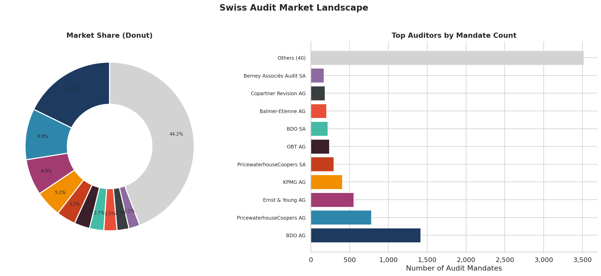

# vynco

Python SDK for the [VynCo](https://vynco.ch) Swiss Corporate Intelligence API. Access 780,000+ Swiss companies from the commercial register with historical timelines, change tracking, sanctions screening, AI-powered risk analysis, UBO resolution, network graphs, watchlists, webhooks, market-flow analytics, and bulk data exports.

<p align="center">
  
</p>

## Installation

```bash
pip install vynco
```

Or with [uv](https://docs.astral.sh/uv/):

```bash
uv add vynco
```

## Quick Start

```python
import vynco

client = vynco.Client("vc_live_your_api_key")

# Search the Swiss commercial register
result = client.companies.list(query="UBS", canton="BS")
uid = result.data.items[0].uid

# Get a single company
company = client.companies.get(uid)
print(f"{company.data.name} ({company.data.legal_form})")

# Full company details with persons, changes, relationships
full = client.companies.get_full(uid)
print(f"Board: {len(full.data.persons)} persons, {len(full.data.recent_changes)} recent changes")

# Historical timeline — every change the company ever made
timeline = client.companies.timeline(uid)
print(f"Timeline: {timeline.data.total_events} events")

# UBO resolution — identify ultimate beneficial owners
ubo = client.companies.ubo(uid)
print(f"UBO persons: {len(ubo.data.ubo_persons)} (chain depth: {ubo.data.chain_depth})")

# Sanctions screening (batch — up to 100 UIDs in one call)
batch = client.screening.batch(uids=[uid, "CHE-101.049.653"])
for r in batch.data.results:
    print(f"  {r.company_name}: {r.risk_level} ({r.total_hits} hits)")

# AI risk score
risk = client.ai.risk_score(uid=uid)
print(f"Risk: {risk.data.overall_score}/100 ({risk.data.risk_level})")

# Industry benchmarking — percentile ranks vs industry peers
bench = client.analytics.benchmark(uid=uid)
for d in bench.data.dimensions:
    print(f"  {d.name}: {d.percentile:.0f}th percentile")
```

## Async Usage

```python
import vynco

async def main():
    async with vynco.AsyncClient("vc_live_your_api_key") as client:
        result = await client.companies.list(query="Novartis")
        print(result.data.items[0].name)
```

## Examples and Notebooks

The `examples/` directory contains runnable scripts for common workflows. The `notebooks/` directory contains Jupyter notebooks that produce publication-ready charts.

| Example | Use Case |
|---------|----------|
| [examples/quickstart.py](examples/quickstart.py) | Search, fetch details, response metadata |
| [examples/due_diligence.py](examples/due_diligence.py) | KYC/AML screening, risk score, classification, fingerprint |
| [examples/watchlist_monitor.py](examples/watchlist_monitor.py) | Portfolio monitoring with event feed |
| [examples/company_network.py](examples/company_network.py) | Board members, relationships, hierarchy, graph |
| [examples/bulk_export.py](examples/bulk_export.py) | CSV export and async bulk export jobs |
| [examples/historical_timeline.py](examples/historical_timeline.py) | Chronological company timeline + AI narrative |
| [examples/ubo_resolution.py](examples/ubo_resolution.py) | UBO + ownership chain + batch screening |

| Notebook | Featured Figures |
|----------|------------------|
| [notebooks/swiss_market_analytics.ipynb](notebooks/swiss_market_analytics.ipynb) | Canton distribution, auditor market share, RFM segments |
| [notebooks/company_deep_dive.ipynb](notebooks/company_deep_dive.ipynb) | Company profile card, board, risk score, corporate network |
| [notebooks/compliance_screening.ipynb](notebooks/compliance_screening.ipynb) | Batch screening, risk heatmap, compliance dashboard |
| [notebooks/market_flows.ipynb](notebooks/market_flows.ipynb) | Registrations vs dissolutions, canton migrations |
| [notebooks/similar_companies.ipynb](notebooks/similar_companies.ipynb) | Peer discovery + industry benchmark radar |

See [examples/README.md](examples/README.md) and [notebooks/README.md](notebooks/README.md) for details.

<p align="center">
  
  
</p>

## API Coverage

20 resource modules covering 100+ endpoints:

| Resource | Methods |
|----------|---------|
| `client.health` | `check` |
| `client.companies` | `list`, `get`, `get_full`, `count`, `events`, `statistics`, `compare`, `news`, `reports`, `relationships`, `hierarchy`, `classification`, `fingerprint`, `structure`, `acquisitions`, `nearby`, `timeline`, `timeline_summary`, `similar`, `ubo`, `media`, `media_analyze`, `notes`, `create_note`, `update_note`, `delete_note`, `tags`, `create_tag`, `delete_tag`, `all_tags`, `export_csv` |
| `client.auditors` | `history`, `tenures` |
| `client.dashboard` | `get` |
| `client.screening` | `screen`, `batch` |
| `client.watchlists` | `list`, `create`, `delete`, `companies`, `add_companies`, `remove_company`, `events` |
| `client.webhooks` | `list`, `create`, `update`, `delete`, `test`, `deliveries` |
| `client.exports` | `create`, `get`, `download` |
| `client.ai` | `dossier`, `search`, `risk_score`, `risk_score_batch` |
| `client.api_keys` | `list`, `create`, `revoke` |
| `client.credits` | `balance`, `usage`, `history` |
| `client.billing` | `create_checkout`, `create_portal` |
| `client.teams` | `me`, `create`, `members`, `invite_member`, `update_member_role`, `remove_member`, `billing_summary`, `join` |
| `client.changes` | `list`, `by_company`, `statistics` |
| `client.persons` | `board_members`, `search`, `get`, `network` |
| `client.analytics` | `cantons`, `auditors`, `cluster`, `anomalies`, `rfm_segments`, `cohorts`, `candidates`, `flows`, `migrations`, `benchmark` |
| `client.dossiers` | `create`, `list`, `get`, `delete`, `generate` |
| `client.graph` | `get`, `export`, `analyze` |
| `client.alerts` | `list`, `create`, `delete` |
| `client.ownership` | `trace` |

### New in v3.1

- **Historical timeline** — `companies.timeline()` and AI narrative via `companies.timeline_summary()`
- **Similar companies** — `companies.similar()` scored on industry, canton, capital, legal form, auditor tier
- **UBO resolution** — `companies.ubo()` walks the ownership chain and identifies natural persons
- **Ownership trace** — `ownership.trace()` exposes the full chain with circular-ownership detection
- **Media with sentiment** — `companies.media()` filtered by positive/neutral/negative
- **Batch operations** — `screening.batch()` (up to 100 UIDs) and `ai.risk_score_batch()` (up to 50 UIDs)
- **Market analytics** — `analytics.flows()`, `analytics.migrations()`, `analytics.benchmark()`
- **Person network** — `persons.network()` for person-centric investigations with co-directors
- **Saved alerts** — persistent saved queries with optional webhook delivery
- **Pagination on board_members** — pass `page=` and `page_size=` (max 500)
- **Typed hierarchy** — `HierarchyResponse` now uses `HierarchyEntity` (was `Any`)
- **Enriched watchlists** — `WatchlistCompaniesResponse.companies` includes name/status/canton
- **`export_csv`** — new canonical name (`export_excel` kept as a deprecated alias)

## Response Metadata

Every response includes header metadata for credit tracking and rate limiting:

```python
resp = client.companies.get("CHE-101.329.561")

print(f"Request ID: {resp.meta.request_id}")               # X-Request-Id
print(f"Credits used: {resp.meta.credits_used}")            # X-Credits-Used
print(f"Credits remaining: {resp.meta.credits_remaining}")  # X-Credits-Remaining
print(f"Rate limit: {resp.meta.rate_limit_limit}")          # X-RateLimit-Limit
print(f"Rate remaining: {resp.meta.rate_limit_remaining}")  # X-RateLimit-Remaining
print(f"Rate reset: {resp.meta.rate_limit_reset}")          # X-RateLimit-Reset
print(f"Data source: {resp.meta.data_source}")              # X-Data-Source
```

## Configuration

```python
client = vynco.Client(
    api_key="vc_live_xxx",
    base_url="https://vynco.ch/api",  # default
    timeout=30.0,                     # seconds, default
    max_retries=2,                    # default, retries on 429/5xx
)
```

The API key can also be set via the `VYNCO_API_KEY` environment variable:

```bash
export VYNCO_API_KEY=vc_live_your_api_key
```

```python
client = vynco.Client()  # reads from VYNCO_API_KEY
```

The client automatically retries on HTTP 429 (rate limited) and 5xx (server error) with
exponential backoff (500ms x 2^attempt). It respects the `Retry-After` and `X-RateLimit-Reset` headers when present.

## Error Handling

All API errors are mapped to typed exceptions:

```python
try:
    company = client.companies.get("CHE-000.000.000")
except vynco.AuthenticationError:
    print("Invalid API key")
except vynco.InsufficientCreditsError:
    print("Top up credits")
except vynco.ForbiddenError:
    print("Insufficient permissions")
except vynco.NotFoundError as e:
    print(f"Not found: {e.detail}")
except vynco.ValidationError as e:
    print(f"Bad request: {e.detail}")
except vynco.ConflictError:
    print("Resource conflict")
except vynco.RateLimitError:
    print("Rate limited, retry later")
except vynco.ServiceUnavailableError:
    print("AI backend temporarily unavailable")
except vynco.ServerError:
    print("Server error")
except vynco.VyncoError as e:
    print(f"Error ({e.status}): {e.detail}")
```

| Exception | HTTP Status |
|-----------|-------------|
| `AuthenticationError` | 401 |
| `InsufficientCreditsError` | 402 |
| `ForbiddenError` | 403 |
| `NotFoundError` | 404 |
| `ConflictError` | 409 |
| `ValidationError` | 400, 422 |
| `RateLimitError` | 429 |
| `ServerError` | 5xx |
| `ServiceUnavailableError` | 503 |
| `ConfigError` | — (client misconfiguration) |

## Requirements

- Python 3.11+
- [httpx](https://www.python-httpx.org/) (async + sync HTTP)
- [Pydantic](https://docs.pydantic.dev/) v2 (model validation)

## Development

```bash
uv sync                     # install dependencies
uv run pytest               # run tests
uv run ruff check src/      # lint
uv run ruff format src/     # format
uv run mypy src/            # type check
```

## License

Apache-2.0
