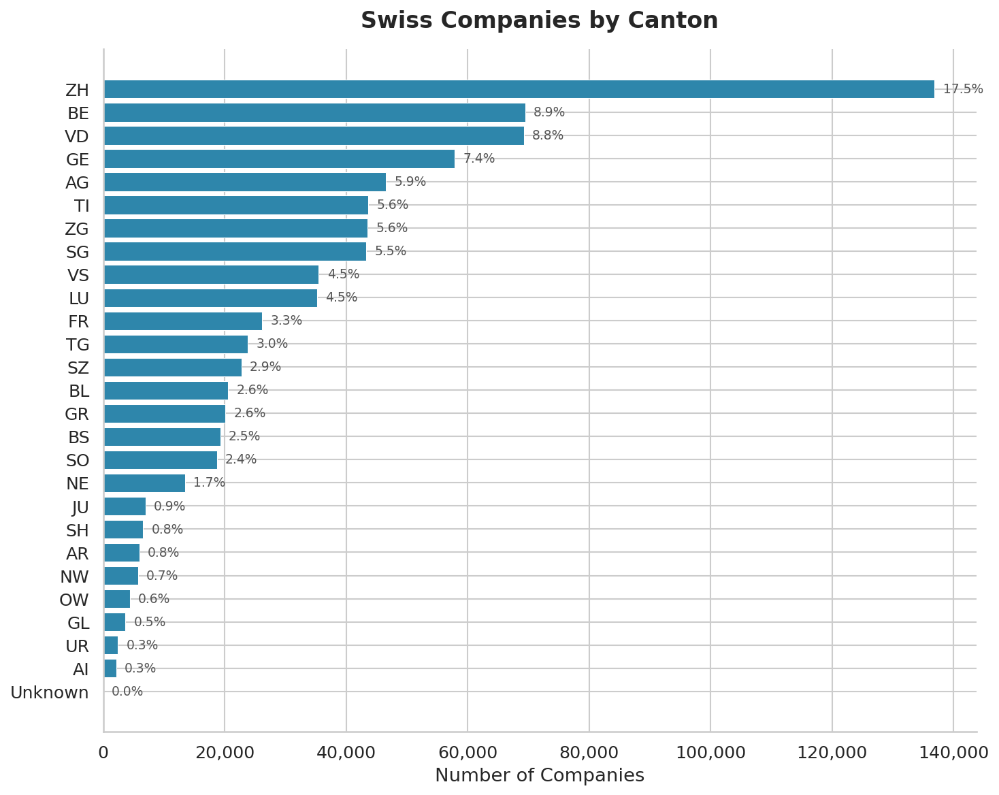
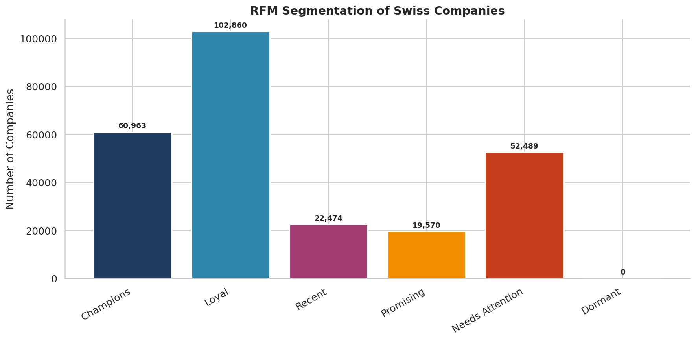
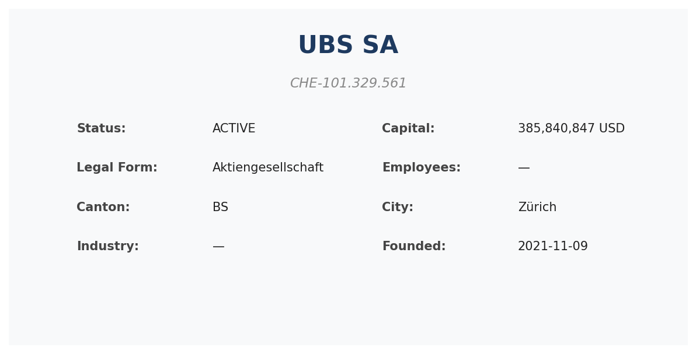
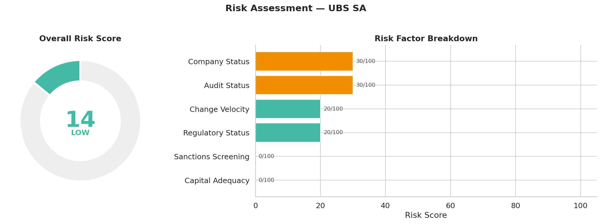
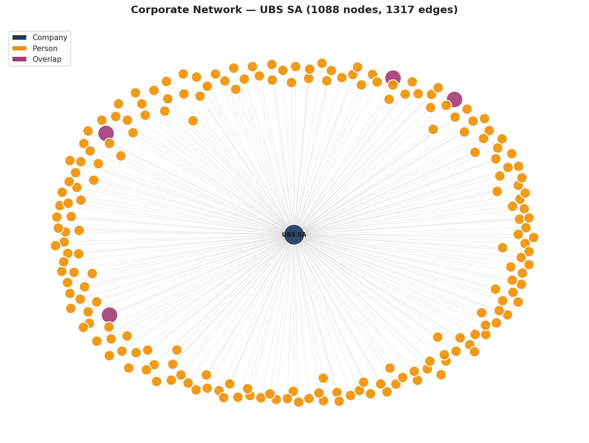
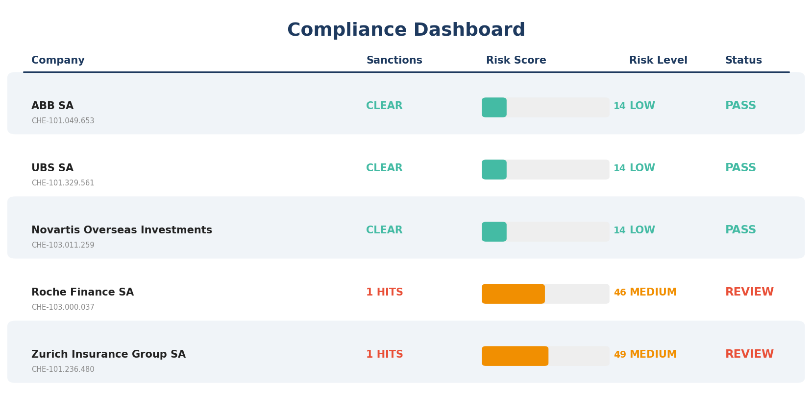
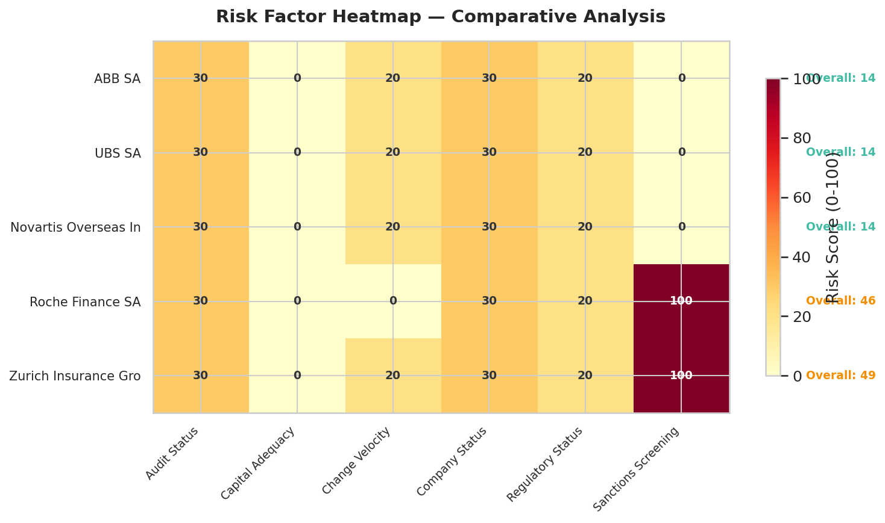

# Notebooks

Jupyter notebooks that produce publication-ready charts from the VynCo API. Every notebook renders its figures into [`figures/`](figures/) at 150 DPI for use in reports, READMEs, or blog posts.

## Setup

```bash
pip install vynco matplotlib seaborn networkx jupyter
export VYNCO_API_KEY=vc_live_your_api_key
jupyter lab
```

Or execute headlessly:

```bash
jupyter nbconvert --to notebook --execute notebooks/<name>.ipynb --output <name>.ipynb
```

## Notebooks

### [swiss_market_analytics.ipynb](swiss_market_analytics.ipynb) — Market landscape

High-level analytics about the Swiss corporate database: canton distribution, auditor market share, status breakdown, cohort analysis, RFM segmentation, and legal-form distribution.

<p align="center">
  
  
</p>

**Figures:** `canton_distribution.png`, `auditor_market_share.png`, `company_statistics.png`, `cohort_analysis.png`, `rfm_segments.png`, `legal_form_distribution.png`

---

### [company_deep_dive.ipynb](company_deep_dive.ipynb) — Single-company investigation

A complete research workflow on one company: profile card, board of directors, risk score with factor breakdown, corporate network graph (up to ~200 nodes), multi-company comparison, and nearby companies on a geographic scatter.

<p align="center">
  
</p>
<p align="center">
  
</p>
<p align="center">
  
</p>

**Figures:** `company_profile_card.png`, `board_members.png`, `risk_score.png`, `corporate_network.png`, `company_comparison.png`, `nearby_companies.png`

---

### [compliance_screening.ipynb](compliance_screening.ipynb) — Batch compliance

Screens multiple companies against sanctions lists, runs AI risk scoring on each, and produces a consolidated compliance dashboard with per-company PASS/MONITOR/REVIEW status.

<p align="center">
  
</p>
<p align="center">
  
</p>

**Figures:** `screening_results.png`, `risk_heatmap.png`, `compliance_dashboard.png`, `fingerprint_comparison.png`

---

### [market_flows.ipynb](market_flows.ipynb) *(v3.1+)* — Market dynamics

Uses the new `analytics.flows()` and `analytics.migrations()` endpoints to visualize registrations vs dissolutions over time, net formation rate, canton-to-canton migration flows, and industry flow rankings.

**Figures:** `market_flows.png`, `canton_migrations.png`, `industry_flows.png`

---

### [similar_companies.ipynb](similar_companies.ipynb) *(v3.1+)* — Peer discovery and benchmarking

Finds similar companies via `companies.similar()` (scored 0–100 on industry, canton, capital, legal form, auditor tier), then benchmarks the target against industry peers with `analytics.benchmark()`. Includes a radar chart and a percentile detail table.

**Figures:** `similar_companies.png`, `benchmark_radar.png`, `benchmark_table.png`

---

## Figure catalog

All figures are regenerated by re-executing the notebooks. They live in [`figures/`](figures/) as 150 DPI PNGs suitable for embedding in documentation or marketing material.

Good candidates for README screenshots or blog hero images:

- `compliance_dashboard.png` — readable at small sizes, lots of information
- `corporate_network.png` — visually striking (UBS: 1086 nodes, 1246 edges)
- `risk_heatmap.png` — shows comparative analysis across multiple companies
- `canton_distribution.png` — classic bar chart, good for "about" pages
- `company_profile_card.png` — clean summary for a single company
- `benchmark_radar.png` — pops on light backgrounds

## Tips

- The notebooks are idempotent — running them repeatedly produces the same figures (same seed for layouts).
- Target companies are looked up dynamically by search query, so they adapt to whatever data is live.
- For the v3.1+ notebooks (`market_flows`, `similar_companies`), ensure your API key has access to the new endpoints.
- Generated figures are kept out of git by default — regenerate them on demand.
